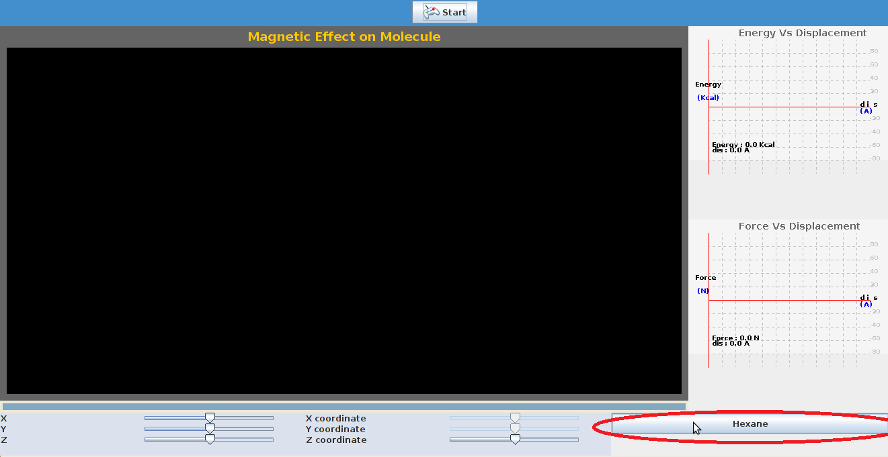
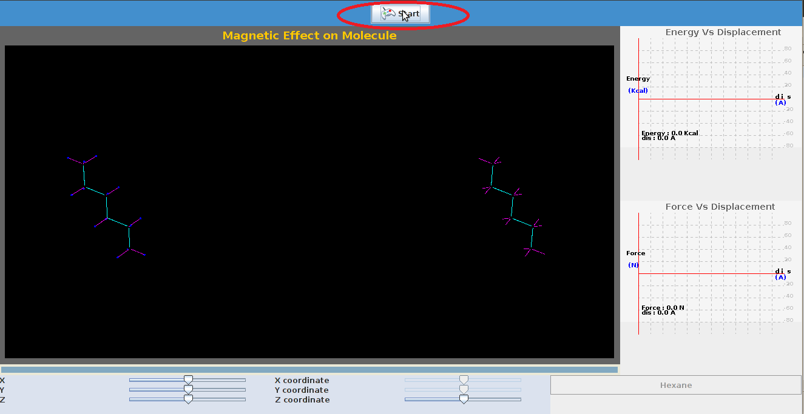
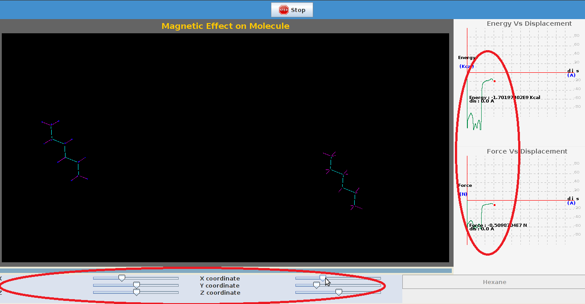

Step 1: Select the molecule by clicking on desired tab on which experiment needs to be performed

Step 2: Click 'Start' tab to initialize the experiment.

Step 3: The positions of molecules can be varied by varying the coordinates on sliders provided.

Step 4   A plot of energy vs distance , Force vs distance can be seen on the extreme right side of the page.

